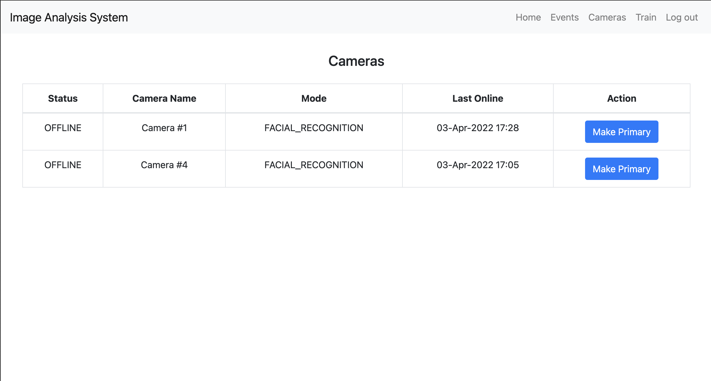
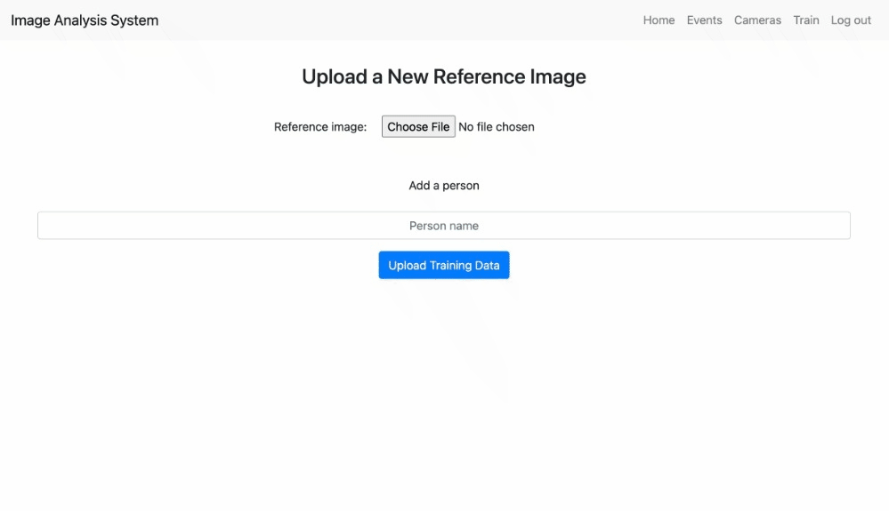
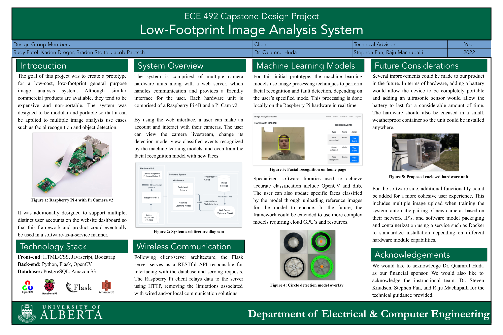

[](https://github.com/rudy-patel/imageAnalysisSystem/actions/workflows/python-app.yml)
[](https://github.com/rudy-patel/imageAnalysisSystem/issues)
[](https://github.com/rudy-patel/imageAnalysisSystem/pulls)

[](https://www.apache.org/licenses/LICENSE-2.0.txt)

# Image Analysis System
This system is a low-footprint versatile application involving hardware and software components for recognition of shapes and/or faces through machine learning algorithms. 

### Web interface
#### Home
After logging in, you will be greeted with the **home page**. Here, you can see the **livestream** of your primary camera (if online), any recent **events**, and also **switch** classification modes between facial/shape detection!

#### Events
On the **events** page, you can sort/search your way through any captured events from your cameras!

#### Cameras
On the **cameras** page, you can see all of the cameras associated with your account, along with seeing their online/offline status, recognition mode, and when it was last online.

#### Train
On the **train** page, you can upload your own reference images to retrain the machine learning models to recognize new faces or simply improve the accuracy.


### First time setup
This project runs inside a Python virtual environment. To set up your environment, follow these steps:
1. Navigate to the root directory in terminal
2. Create a virtual environment using: `python3 -m venv env`

To setup the hardware unit, follow the instructions [here](https://github.com/rudy-patel/imageAnalysisSystem/wiki/Hardware-Configuration).

To setup a new AWS instance + account, follow the instructions in [AWS Setup](https://github.com/rudy-patel/imageAnalysisSystem/blob/running-instructions-for-users/docs/aws_setup.txt).

On **Linux/MacOS**:
- Run `source env/bin/activate` to **start** the Python virtual environment.
- Run `deactivate` to **stop** the Python virtual environment.
- If you need to set an environment variable use: `export <variable>=<value>`. This is only saved in your current terminal.

On **Windows**:
- Run `.\env\Scripts\activate` to **start** the Python virtual environment.
- Run `deactivate` to **stop** the Python virtual environment.
- If you need to set an environment variable use: `set <variable>=<value>`. This is only saved in your current terminal.

You have now created the virtual environment in the project directory, continue following the steps to run the server.

### Running the server (web interface)
To run the server:

1. Navigate to the root directory in terminal.
2. Start the Python virtual environment, following the instructions in First Time Setup.
3. Install the dependencies by running `pip install -r requirements.txt`.
4. Run `python3 -m server.main` to start the server.

You're all set! The server should now be running on `127.0.0.1:5000`.

### Running the client (camera unit)
Running the Client over **LAN** (preferred):
1. Navigate to the root directory in terminal.
2. `git fetch && git pull` to ensure the code is the latest.
3. Navigate to the client/ folder and run `python client.py <ip_address> <port>`.
   Note that <ip_address> and <port> should be typed out as additional arguments to tell the client the ip/port to connect to
  

### Running tests
To run tests, in your virtual environment run:
```bash
python -m pytest
```

### Project overview
This capstone project also has an associated poster with additional information:


### Resources
* [Login using Flask-Login and SQLAlchemy](https://www.youtube.com/watch?v=8aTnmsDMldY)
* [Data tables with bootstrap4](https://www.youtube.com/watch?v=yGBk9Nalyq8)
* [Data models in Flask](https://flask-sqlalchemy.palletsprojects.com/en/2.x/models/)
* [Adding flask-migrate to existing project](https://blog.miguelgrinberg.com/post/how-to-add-flask-migrate-to-an-existing-project)
* [Flask Multi-Camera Streaming](https://gitee.com/huzhuhua/Flask-Multi-Camera-Streaming-With-YOLOv4-and-Deep-SORT/tree/master)
### Contributors
| Name | Email  | Github |
|---|---|---|
|  Rudy Patel | rutvik@ualberta.ca | [@rudy-patel](https://github.com/rudy-patel)|
|  Kaden Dreger | kaden@ualberta.ca | [@kaden-dreger](https://github.com/kaden-dreger) |
|  Jacob Paetsch | jpaetsch@ualberta.ca | [@jpaetsch](https://github.com/jpaetsch)|
|  Braden Stolte | bstolte@ualberta.ca | [@b-stolte](https://github.com/b-stolte)|
